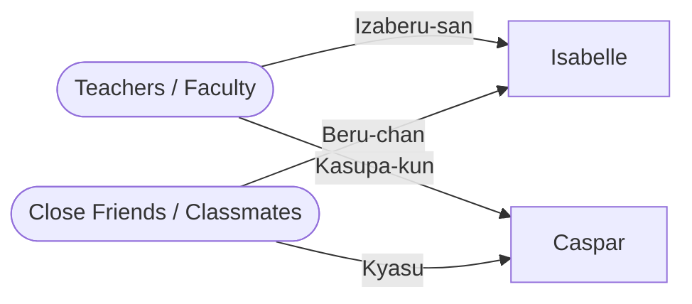

---
tags:
  - lore-bible
  - worldbuilding
aliases:
  - Forms of Address
  - Name Reference
---

# Japanese Forms of Address

Japanese schools highly depend on social hierarchy, meaning teachers and friends will naturally adopt different ways of referring to students.

## Isabelle

- **Teachers:** イザベルさん (Izaberu-san) — While teachers typically use last names, "Fan Rein" is treated as a double name and is somewhat long. Teachers default to her first name with the polite, gender-neutral suffix "-san".
- **Classmates:** ベルちゃん (Beru-chan) — Friends drop "-san" and use a shortened, affectionate nickname. "Beru" (Belle) combined with the "cute" suffix "-chan" is standard for close female peers.

## Caspar

- **Teachers:** カスパーくん (Kasupa-kun) — Teachers use his relatively short first name with "-kun", the standard polite suffix for male students.
- **Classmates:** キャス (Kyasu) — Friends bypass formal names, using an anglicized/shortened nickname "Cas" with no honorific. Indicates a close, casual relationship.

**Related:** [[Isabelle van Rijn]] | [[Caspar Waldstein]] | [[Tokyo - The Silent Apology]]