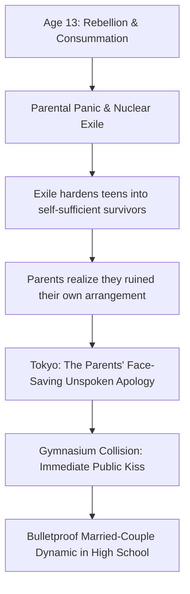

---
tags:
  - lore-bible
  - events
aliases:
  - Tokyo
  - Silent Apology
---

# Tokyo: The Silent Apology (April 2017)

When the exile fails to break the teenagers, the parents realize they
accidentally nuked their own master plan. They hardened their kids into
self-sufficient laborers.

Tokyo is not a trap or a punishment. It is a face-saving retreat. Billionaire
chaebol leaders do not say "we made a mistake." They change the geography.
Dropping Isabelle and Caspar in the exact same Setagaya public school and
returning their caretakers is the parents' way of saying: We surrender. Here are
three years to be normal.

## The Entrance Ceremony Collision

Japanese high school entrance ceremonies are rigid, silent, and conformist.
Isabelle and Caspar hear each other's names during roll call. They lock eyes.

There is no slow-burn realization. There is no waiting for an empty hallway.
After 2.5 years of surviving manual labor and trainee abuse to get back to each
other, they don't hesitate. Caspar stands up, walks across the gymnasium floor
in front of three hundred freezing freshmen, and Isabelle meets him. They kiss.
Desperate, possessive, European, completely unapologetic.

The gymnasium short-circuits. In the back row, Jungsook and Myunghi just adjust
their purses.

## The "Bulletproof" Dynamic

There is no "will they/won't they" in this story. They possess the energy of a
fifty-year-old married couple trapped in adolescent bodies. They sit physically
entangled during class breaks. They argue in fluent, hushed German about laundry
detergent. There is zero jealousy; if a classmate hits on one of them, the other
patiently helps let the suitor down.

**Related:** [[The Exile]] | [[The Caretakers]] | [[The Six Friends]] |
[[Work - Choosing the Dynasty]]
