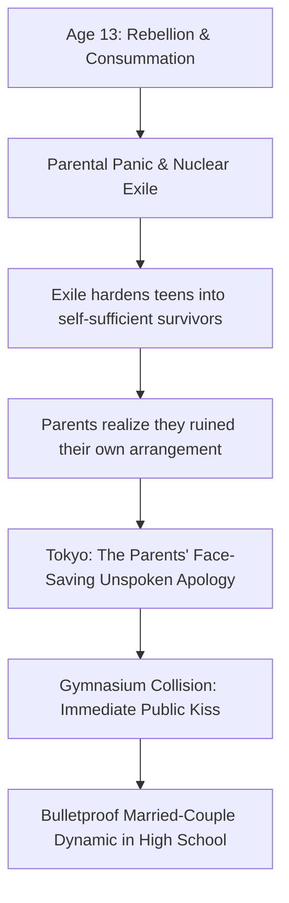

---
tags:
  - lore-bible
  - events
aliases:
  - Tokyo
  - Silent Apology
---

# Tokyo: The Silent Apology (April 2017)

When the exile fails to break the teenagers, the parents realize they
accidentally nuked their own master plan. They hardened their kids into
self-sufficient laborers.

Tokyo is not a trap or a punishment. It is a face-saving retreat. Billionaire
chaebol leaders do not say "we made a mistake." They change the geography.
Dropping Isabelle and Caspar in the exact same Setagaya public school — 1年5組 —
and returning their caretakers is the parents' way of saying: We surrender. Here
are three years to be normal.

## The Entrance Ceremony Collision

The first homeroom of the academic year. Class 5, second floor, west wing.
Cherry trees outside the windows shedding past-peak petals. Thirty-four assigned
seats, one still empty — Ryu Tae-sung.

Isabelle sits near the back, by the window. The other students have already
sized her up during the ceremony: tall, caramel-blonde, posture like a
photograph, Japanese fluent and faintly accented. The empty seat has been a low
current of speculation all morning.

The door slides open.

Caspar — shoulders filling the doorway, uniform somehow wrong on him, pale blue
eyes, crumpled entrance-ceremony program gripped too hard — stands there. He
checked three wrong classrooms before finding this one. He is breathing hard.

Yamamoto-sensei opens his mouth to direct the late arrival to his seat.

Isabelle stands up.

Not tentatively. Like a dancer — weight shifting from the core, chair scraping
back hard enough to cut the murmur. She does not look at the teacher. She does
not look at her classmates. She looks at the doorway, and the crumpled program
in his hand that matches the one on her desk.

2.5 years. Thirty months of silence, exile, practice rooms with no clocks, Jeju
greenhouses, madeleines at two in the morning because sleep wouldn't come. Not
knowing if he was okay. Trusting, because they had promised, but not knowing.

She wasn't waiting anymore. He walked toward her. Not to his assigned seat. She
met him in the middle of the classroom.

Their mouths met. Not gentle, not cute — desperate, possessive, European.
Short-circuited every social norm the Japanese education system had cultivated
in decades. She made a sound against his mouth — half sob, half laugh. His arms
tightened. She tilted her head and deepened it and for a suspended moment there
was nothing else. Not the classroom. Not the teacher. Not the thirty-three
students who had collectively forgotten how to breathe.

When they broke apart — foreheads pressed together, her hands still fisted in
his blazer — the silence had weight. Yamamoto-sensei's clipboard was on the
floor. He had not noticed it fall.

### The Class Reacts

The friends-to-be catalog the collision in real time:

- **Tsukada Rin** — gripping her desk, making a noise between a wheeze and a
  scream, no actual sound emerging.
- **Nakamura Aoi** — staring at Isabelle's body control during the kiss. The
  extension. The physical vocabulary of years of training.
- **Ogawa Shun** — cataloging details with war-correspondent intensity: the
  crumpled programs, the wordless approach, the fact that Caspar's hands are
  still trembling against Isabelle's back.
- **Miyake Renta** — fully, painfully awake for the first time all morning.
  Opens his mouth. Closes it. "What," he says, to no one.
- **Fujita Moe** — already taking notes. Her handwriting is jagged with
  adrenaline.

### The Aftermath

Isabelle, still holding Caspar's hand with white-knuckled force, switches to
Japanese and addresses Yamamoto-sensei with perfect poise: "Apologies. We were
separated for some time. The reunion was unexpected." She does not look
embarrassed. She looks annoyed that reality intruded.

Yamamoto-sensei picks up his clipboard. "Please take your seats."

The rest of homeroom proceeds in suspended animation. Timetables distributed,
textbook lists explained, no one hearing a word. In the back of the room, Caspar
takes his assigned seat and immediately reaches across the aisle for Isabelle's
hand. She takes it without looking. His thumb traces circles on her knuckles.

At 9:13 PM, the class LINE group explodes. Moe has already compiled a
preliminary timeline. Rin is still screaming about the hand-holding. Shun
reports seven instances of physical contact in the remaining forty minutes. Aoi
identifies the collar-fix as domestic, not romantic — "I have done this a
thousand times." They are hooked. The mystery isn't "do they like each other?"
It is "what kind of war did these two survive?"

## The "Bulletproof" Dynamic

There is no "will they/won't they" in this story. They possess the energy of a
fifty-year-old married couple trapped in adolescent bodies. They sit physically
entangled during class breaks. They argue in fluent, hushed German about laundry
detergent. There is zero jealousy; if a classmate hits on one of them, the other
patiently helps let the suitor down.

**Related:** [[The Exile]] | [[The Caretakers]] | [[The Six Friends]] |
[[Work - Choosing the Dynasty]]
